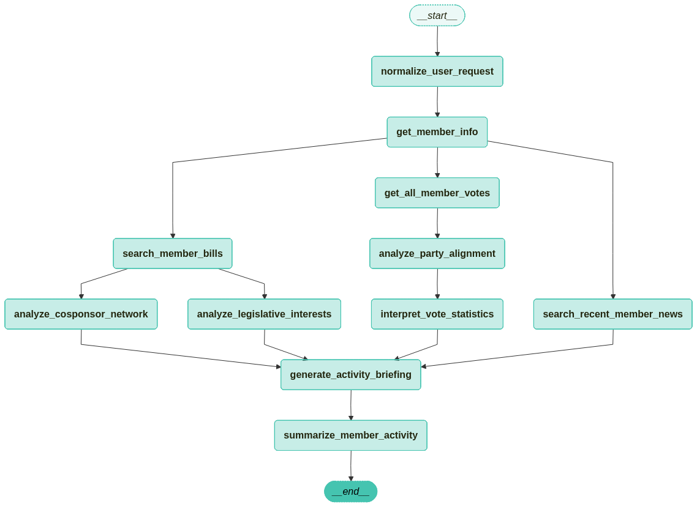
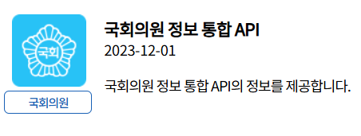
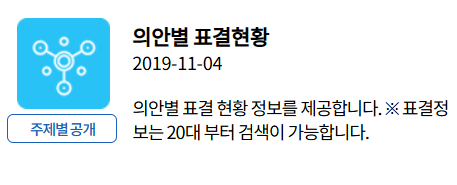

# 국회의원 의정활동 추적 AI 에이전트 개발 기획안

  
경희대학교 사회학과 2021100380 박찬규

  
<strong>사이트 주소: https://national-assembly.streamlit.app/</strong>

  
<strong>Github repo: https://github.com/ppck75/assembly-member_LangGraph-tracker</strong>

  
데모 영상:

## 1. 프로젝트 제목

---

**국회의원 의정활동 추적 AI 에이전트: 발의법안·표결·정당 다수 입장 일치도·공동발의 네트워크를 통합 분석하는 데이터 기반 정치 커뮤니케이션 웹서비스**

본 프로젝트는 사용자가 국회의원 이름을 입력하면 기본정보, 발의법안, 공동발의 네트워크, 본회의 표결 기록, 정당 다수 입장 일치도, 최근 언론 이슈를 한 화면에서 조회·분석할 수 있는 **LangGraph 기반 의정활동 추적 AI 에이전트**를 개발하는 것을 목표로 한다. 단순 의원 검색이 아니라 열린국회정보 API와 뉴스 데이터를 결합해 국회의원의 의정활동을 근거 중심으로 이해할 수 있게 하는 웹서비스이다.

현재 베타 버전은 Streamlit으로 구현되어 있으며, 의원명을 입력하면 발의법안 분석, 공동발의 네트워크, 표결 상세 조회, 정당 일치도 계산, 최근 뉴스 요약, 핵심 브리핑, 원자료 다운로드가 실행된다. 사용자는 사이드바에서 분석 범위와 LLM 사용 여부를 조정할 수 있다.

  

이 이미지는 LangGraph로 구현한 에이전트 워크플로우를 그래프 형태로 시각화한 것이다. 사용자의 의원명 입력이 어떤 분석 노드를 거쳐 최종 브리핑으로 병합되는지를 보여준다. 입력 정규화와 의원 기본정보 조회 후 발의법안 조회·표결 상세 조회·최근 이슈 검색을 병렬로 실행한다. 이후 입법 관심 분야, 공동발의 네트워크, 정당 다수 입장 일치도, 표결 해석 메모를 생성하고, 모든 결과를 `generate_activity_briefing` 노드에서 병합해 브리핑과 대시보드로 제공한다.

## 2. 프로젝트 필요성

---

### 2.1 사회적 문제와 개발 필요성

국회의원의 의정활동은 시민의 정치적 판단, 언론의 권력 감시, 시민단체의 정책 평가에 필요한 핵심 정보이다. 그러나 실제 데이터는 국회의원 기본정보, 발의법안, 의안별 표결현황, 의원별 본회의 표결정보처럼 여러 API와 웹페이지에 흩어져 있다. 특정 의원의 활동을 이해하려면 각 API를 따로 조회하고 표결값·정당·의안 정보를 다시 조합해야 한다. 특히 표결 불참, 정당 다수 입장 이탈, 분야별 발의 집중, 반복 공동발의 관계는 단일 자료만으로 파악하기 어렵다.

이재윤·김의진·박태선(2024)에 따르면 의정활동 기록은 국가와 지역의 복합적인 사회 현안을 포함하는 동시에 의원의 관점과 개성이 연결된 결과물이다. 국회의원은 국회라는 합의체의 구성원, 국민 전체의 대표자, 정당정치에 참여하는 행위자라는 복합적 지위를 갖기 때문에, 발의법안과 표결 기록은 단순 행정 데이터가 아니라 의원이 어떤 의제에 관심을 두고 어떤 판단을 반복해왔는지 보여주는 정치적 기록으로 볼 수 있다.

이로 인해 국회의원 평가는 실제 기록보다 단편적 기사, 정쟁적 발언, 이미지 중심 정보에 의존하기 쉽다. 본 프로젝트는 공개되어 있지만 흩어져 있는 제도정치 데이터를 시민이 바로 이해할 수 있는 정보로 재구성해 정치 정보 접근성과 데이터 기반 감시저널리즘을 지원한다.

하버마스(2006)의 공론장 논의와 Strömbäck(2005)의 저널리즘 감시 기능 논의를 고려할 때, 본 프로젝트는 단순 조회 서비스가 아니라 제도정치와 시민사회 사이의 정보 격차를 줄이는 정치 커뮤니케이션 도구이다.

### 2.2 참신성

기존 국회 정보 서비스가 API별·자료 유형별 조회에 가까웠다면, 본 프로젝트는 **개별 의원 중심의 통합 의정활동 분석**을 제공한다. 한 의원을 기준으로 기본정보, 발의법안, 본회의 표결, 정당 다수 입장 일치도, 공동발의 네트워크, 최근 이슈를 하나의 워크플로우 안에서 연결한다.

본 프로젝트의 참신성은 다섯 가지이다. 첫째, 발의법안과 본회의 표결 기록을 하나의 의원 프로필 안에서 연결해, 특정 의원이 어떤 법안을 발의했고 어떤 표결 선택을 반복했는지 함께 확인할 수 있게 한다. 둘째, 공동발의 관계를 1차 ego-network로 시각화해 반복 협업 의원, 당내·당외 협업 비율, 협업 소관위원회를 보여준다. 법률안 발의에는 의원 10인 이상의 찬성이 필요하므로, 공동발의 관계는 법안 발의 과정에서 형성된 입법 협력 관계를 탐색하는 지표가 된다. 셋째, 공식 당론을 직접 판정하지 않고 같은 정당 의원들이 실제로 가장 많이 선택한 표결값을 정당 다수 입장으로 계산해, 대상 의원의 일치·이탈·불참을 분류한다. 넷째, 열린국회정보 API 기반 공식 의정활동 데이터와 Google News RSS 기반 최근 이슈를 구분해 함께 제공함으로써 제도적 활동과 공적 보도 맥락을 동시에 볼 수 있게 한다. 다섯째, LangGraph 기반 **Parallel Workflow**를 적용해 서로 의존하지 않는 발의법안 조회, 표결 상세 조회, 최근 뉴스 검색을 병렬 실행한다. 이는 단순 챗봇이 아니라 공공데이터 수집·계산·해석·시각화를 결합한 데이터 에이전트라는 점에서 차별화된다.

### 2.3 활용 방안

본 서비스는 시민, 언론인, 시민단체, 연구자, 정치·저널리즘 교육 현장에서 활용될 수 있다.

- **시민**은 의원의 이미지나 정쟁적 발언이 아니라 발의, 표결, 정당 일치도, 최근 이슈라는 객관적 자료를 바탕으로 의정활동을 살펴볼 수 있다.
- **언론인**은 표결 이탈, 불참 비중, 반복 공동발의 관계, 특정 정책 분야에 집중된 입법 활동을 확인해 후속 취재의 단서를 얻을 수 있다.
- **시민단체와 정책 감시 조직**은 특정 의제나 위원회 중심으로 의원별 활동을 비교하는 기초 자료로 활용할 수 있다.
- **정치 커뮤니케이션·저널리즘 교육**에서는 공공데이터 기반 감시저널리즘, 데이터 저널리즘, 공론장 정보 매개 장치의 사례로 활용할 수 있다.

하버마스(2006)가 공론장을 국가와 사회 사이의 의사소통 체계로 설명했듯, 숙의 민주주의가 작동하려면 시민이 공적 쟁점에 접근하고 이해할 수 있어야 한다. Strömbäck(2005)의 논의처럼 저널리즘도 시민의 자율적 판단을 위한 정보 제공과 권력 감시 기능을 수행한다. 이러한 관점에서 본 프로젝트는 단순한 정보 조회 서비스가 아니라 제도정치와 시민사회 사이의 정보 격차를 줄이는 데이터 기반 정치 커뮤니케이션 도구로 기능할 수 있다.

## 3. 데이터 출처 및 수집 계획

---

본 프로젝트는 열린국회정보 API와 Google News RSS를 주요 데이터 소스로 사용한다. 열린국회정보 API는 공식 의정활동 데이터 수집에 사용하고, Google News RSS는 최근 의원 관련 공개 이슈를 보조적으로 파악하는 데 사용한다.

<table>
  <tr>
    <td>
      
    </td>
    <td>
      
    </td>
  </tr>
  <tr>
    <td>
      
    </td>
    <td>
      
    </td>
  </tr>
</table>

| 데이터 | API 코드 | 사용 목적 |
|---|:---:|---|
| 국회의원 정보 통합 API | `ALLNAMEMBER` | 의원명, 정당, 선거구, 위원회, 재임 대수 확인 |
| 국회의원 발의법률안 | `nzmimeepazxkubdpn` | 대표발의·공동발의 법안, 처리결과, 소관위원회 수집 |
| 의안별 표결현황 | `ncocpgfiaoituanbr` | 표결 의안 목록, `BILL_ID`, 표결일 후보 수집 |
| 국회의원 본회의 표결정보 | `nojepdqqaweusdfbi` | 의원별 표결값, 정당별 표결 분포, 찬성·반대·기권·불참 분류 |

수집 절차는 `ALLNAMEMBER`로 의원의 정당, 선거구, 위원회, 재임 대수를 확인하고 API가 지원하는 대수만 분석 대상으로 제한하는 방식으로 시작한다. 발의법안은 의원명과 대수 기준으로 조회하되 공동발의자 문자열을 추가 스캔한다. 표결 정보는 의안별 표결현황에서 `BILL_ID` 목록을 확보한 뒤 의원별 본회의 표결정보와 정당별 표결 분포를 결합한다. 최근 이슈는 `{의원이름} 국회의원 {정당명}` 쿼리로 Google News RSS를 검색하며, 공식 의정활동 데이터와 웹 검색 기반 맥락을 구분한다.

## 4. 분석·개발 방법론

---

### 4.1 시스템 구조와 기술스택

시스템은 **Streamlit 웹 인터페이스**, **LangGraph 워크플로우**, **열린국회정보 API 수집 모듈**, **LLM 해석 모듈**, **캐시·오류 격리 계층**, **시각화 컴포넌트**로 구성된다. 핵심 파일은 `app.py`(UI와 탭 렌더링), `src/member_activity_workflow.py`(LangGraph 노드, API 호출, 캐시, LLM 분석, 표결·정당 일치도 계산), `src/config.py`(API 키와 환경 변수), `src/member_directory.py`(의원 목록·정당 매칭), `src/streamlit_runtime.py`(클라이언트·그래프 재사용)이다.

주요 기술스택은 Python, Streamlit, LangGraph, LangChain Core, LangChain Google GenAI, pandas, requests, python-dotenv이다. 시각화에는 Streamlit 기본 UI, ECharts, vis-network CDN을 사용하고, LLM 모델은 `gemini-2.5-flash-lite`로 고정한다. 열린국회정보 API 키는 서버 측 환경 변수로 관리하고, 사용자는 Gemini API 키를 직접 입력해 LLM 분석을 사용할 수 있다.

### 4.2 LangGraph 워크플로우와 성능 개선

본 프로젝트는 LLM이 임의로 도구 호출 순서를 정하는 챗봇이 아니라, `StateGraph(MemberActivityState)`로 노드와 의존 관계를 코드 수준에서 정의한 데이터 에이전트이다. 전체 흐름은 선행 실행 이후 서로 독립적인 작업을 병렬로 분기하고, 각 분기 분석이 끝난 뒤 결과를 다시 합치는 Parallel Workflow 구조이다.

| 실행 구간 | 노드명 | 실행 방식 | 역할 |
|:---|:---|:---|:---|
| 1 | `normalize_user_request` | 선행 실행 | 사용자 요청 및 분석 옵션 정규화 |
| 2 | `get_member_info` | 선행 실행 | 의원 기본정보, 재임 대수, 분석 가능 대수 산출 |
| 3-A | `search_member_bills` | 병렬 실행 | 대표발의·공동발의 법안 수집 및 처리결과/소관위원회 통계 계산 |
| 3-B | `get_all_member_votes` | 병렬 실행 | 본회의 표결 상세 조회 및 찬성·반대·기권·불참 분류 |
| 3-C | `search_recent_member_news` | 병렬 실행 | Google News RSS 기반 최근 이슈 수집 및 요약 |
| 4-A-1 | `analyze_legislative_inter ests` | 병렬 실행 | 발의법안 기반 입법 관심 분야 분석 |
| 4-A-2 | `analyze_cosponsor_network` | 병렬 실행 | 공동발의 파트너 및 협업 패턴 분석 |
| 4-B-1 | `analyze_party_alignment` | 순차 실행 | 같은 정당 의원 다수 입장과의 일치·이탈 분석 |
| 4-B-2 | `interpret_vote_statistics` | 순차 실행 | 조회 범위와 불참 비중을 고려한 표결 해석 메모 생성 |
| 5 | `generate_activity_briefing` | Fan-in 이후 실행 | 입법·공동발의·표결·최근 이슈를 종합한 핵심 브리핑 생성 |
| 6 | `summarize_member_activity` | 최종 실행 | 화면 표시용 요약 결과 정리 |

초기 구현은 모든 노드를 Sequential Workflow로 연결해 순차 처리했다. 구조는 단순했지만 API 호출, LLM 해석, 통계 계산이 차례로 대기하면서 기본 설정값(최근 재임 대수, 표결 상세 100건, 정당 일치도 100건) 기준 약 1분 30초~2분이 소요되었다. 현재는 이를 **Parallel Workflow**로 전환했다. 병렬화 기준은 서로의 산출물을 기다릴 필요가 없고, API 호출이나 중간 계산 작업이 서로 겹치지 않는 노드만 동시에 실행하는 것이다. 발의법안 조회와 표결 상세 조회는 의원 기본정보만 필요하지만 서로 다른 데이터 조회 흐름을 사용하므로 동시에 실행하고, 정당 다수 입장 일치도는 표결 상세 조회 이후에만 계산한다. 이 전환으로 기본 설정 기준 약 1분가량 실행 시간이 단축되었다.

병렬 노드들이 동시에 오류 메시지나 LLM quota 상태를 갱신할 수 있으므로 상태 병합에는 reducer를 적용한다. `errors`는 `merge_unique_messages`로 중복 없이 병합하고, `llm_quota_exhausted`는 `bool_or`로 병합한다.

### 4.3 주요 분석 기능

**의원 기본정보 및 재임 대수 필터링**은 전체 분석의 기준점이다. 사용자가 의원명을 입력하면 먼저 국회의원 정보 통합 API에서 정당, 선거구, 위원회, 재임 대수를 확인하고, 이후 분석 범위를 해당 의원이 실제 활동한 대수로 제한한다. 이를 통해 모든 대수를 무작정 조회하는 비효율을 줄이고, 활동하지 않은 기간이 분석 결과에 섞이는 오류를 방지한다.

**발의법안 분석과 입법 관심 분야 해석**은 의원별 발의법안 API를 기반으로 대표발의와 공동발의를 구분하고, 처리결과와 소관위원회별 통계를 계산한다. LLM은 발의법안 목록과 위원회 분포를 바탕으로 입법 관심 분야를 요약하되, 정치적 호불호나 성과 평가가 아니라 법안명과 통계에 근거한 제한적 해석만 생성하도록 설계했다.

**공동발의 네트워크 분석**은 대상 의원과 같은 법안에 이름을 올린 의원들을 연결하는 1차 ego-network로 구성한다. 공동발의 빈도에 따라 노드 크기를 조정하고, 협업 관계를 당내·당외·정당 미확인으로 구분하며, 반복 협업 의원과 협업 소관위원회도 함께 제시한다. 다만 공동발의가 정책 동의나 친소관계를 직접 증명하는 것은 아니므로, 법안 발의 과정에서 나타난 입법 협력 관계를 탐색하는 지표로 해석한다.

**표결 상세 조회**는 `ncocpgfiaoituanbr`와 `nojepdqqaweusdfbi`를 결합한다. 의안별 표결현황 API에서 표결 대상 의안과 `BILL_ID`를 확보하고, 의원별 본회의 표결정보 API에서 찬성·반대·기권·불참 기록을 수집한다. 기본 범위는 최근 100건이며 사용자가 조정할 수 있다. 먼저 의원명 기준 일괄 조회를 시도하고, 부족한 경우 `BILL_ID`별 조회로 보완한다. 표결 조회는 호출량이 많기 때문에 캐시를 적극 사용하고, 일부 API 실패가 있어도 성공·실패 건수를 분리해 전체 워크플로우가 중단되지 않도록 한다.

**정당 다수 입장 일치도 분석**은 공식 당론 판정이 아니다. 각 표결에서 같은 정당 의원들이 실제로 가장 많이 선택한 찬성·반대·기권 값을 정당 다수 입장으로 계산하고, 대상 의원의 표결이 같으면 일치, 다르면 이탈, 대상 의원이 표결하지 않았으면 불참으로 분류한다. 무소속, 정당 내 유효 표결 없음, 찬반기권 동률은 판정 제외로 처리한다. 이 지표는 의원 개인의 표결 행동을 정당정치의 맥락 속에서 이해하기 위한 보조 지표이다.

**최근 이슈 요약과 핵심 브리핑**은 Google News RSS에서 검색한 기사 메타데이터를 기반으로 한다. LLM은 제공된 검색 결과만 근거로 최근 이슈를 요약하며, 기사 내용의 사실관계나 의원의 의도를 단정하지 않는다. 최종 핵심 브리핑은 의원 프로필, 발의법안 통계, 공동발의 네트워크, 표결 요약, 정당 일치도 요약, 최근 뉴스 수를 결합해 첫 화면에서 빠르게 이해할 수 있는 요약으로 제공한다.

### 4.4 LLM, 캐시, 오류 격리

LLM은 해석 보조 역할에 한정한다. 모든 프롬프트는 제공된 JSON 통계와 API 결과만 근거로 분석하고, 정치적 호불호·성과 평가·의도 추정을 피하며, 공식 의정활동 데이터와 웹 검색 기반 데이터를 구분하도록 설계했다. LLM 호출 실패나 quota 초과 시에는 규칙 기반 fallback을 사용한다.

실행 시간을 줄이기 위해 의원 목록은 Streamlit 캐시로, 발의법안·표결 의안 목록·의원별 표결·BILL_ID별 정당 표결 분포·LLM 결과·최근 뉴스는 파일 캐시로 저장한다. 기본 TTL은 24시간이며 최근 뉴스는 6시간 기준으로 관리한다. 표결 수백 건 중 일부 호출이 실패해도 부분 결과를 제공하고, 실패분은 다음 실행에서 재시도할 수 있게 설계했다.

## 5. 베타 구현 현황과 평가

---

베타 버전은 Streamlit 앱으로 배포 가능한 상태이며, 요약 탭, 발의 법안 탭, 표결 탭, 정당 일치도 탭, 최근 이슈 탭, 원자료 탭을 제공한다. 각 탭에서는 의원 프로필과 핵심 브리핑, 발의 통계와 공동발의 네트워크, 찬성·반대·기권·불참 분류, 정당 일치도 요약과 이탈 표결 목록, Google News RSS 기사 목록, 워크플로우 JSON과 오류 메시지를 확인할 수 있다.

프로젝트의 실현 가능성은 높다. 열린국회정보 API와 Google News RSS를 실제로 호출하고 있으며, Streamlit 배포 구조, 캐시, 병렬 조회, 오류 격리, LLM fallback이 구현되어 있다. 참신성은 단일 API 조회가 아니라 의원 중심 통합 분석과 Parallel Workflow 기반 데이터 에이전트 구조에 있으며, 필요성은 공개 의정활동 데이터를 시민이 이해 가능한 정보로 바꾼다는 점에 있다.

## 6. 발전 방향 및 기대 효과

---

향후 핵심 개선 방향은 표결 상세 조회를 최근 N건 기준에서 **본회의 날짜 기준**으로 확장하는 것이다. 최근 N건 방식은 하루에 많은 표결이 몰릴 경우 특정 날짜의 맥락이 일부만 반영되고, 의원이 전부 불참한 본회의 날짜가 잘 드러나지 않는 한계가 있다. 날짜 기반 방식은 의안별 표결현황 API에서 본회의 날짜 목록을 만들고, 사용자가 선택한 날짜의 전체 `BILL_ID`를 기준으로 찬성·반대·기권·불참과 정당 다수 입장 일치도를 다시 계산한다. 기본값은 최근 N건으로 유지하되, 사용자가 “날짜 후보 불러오기” 버튼을 눌렀을 때만 후보를 조회한다.

추가 고도화 방향으로는 의원 간 비교 기능, 정책 키워드 기반 발의·표결 추적, 소관위원회와 의정활동 연계, 뉴스 관련성 필터 고도화, Markdown·PDF·CSV 리포트 내보내기, API 제공 범위 안내 강화가 있다.

본 프로젝트는 국회의원 의정활동을 데이터 기반으로 감시하고 이해할 수 있는 기반을 제공한다. 시민은 발의법안과 표결을 빠르게 확인하고, 정당 다수 입장과의 관계를 통해 표결 행동의 맥락을 살펴볼 수 있다. 언론인은 반복 공동발의, 특정 분야 발의 집중, 높은 불참 비중, 정당 다수 입장 이탈 표결을 취재 단서로 활용할 수 있다. 기술적으로는 LangGraph를 활용해 공공데이터 수집, Parallel Workflow, 캐시, 오류 격리, LLM 기반 해석을 결합한 실용적 AI 에이전트 사례를 제시한다.

## 7. 참고문헌

---

- 이재윤·김의진·박태선. (2024). 「국회의원 의정활동 기록의 개념과 특성에 관한 고찰」.
- Habermas, J. (2006). Political Communication in Media Society: Does Democracy Still Enjoy an Epistemic Dimension? The Impact of Normative Theory on Empirical Research. *Communication Theory*, 16(4), 411-426.
- Strömbäck, J. (2005). In Search of a Standard: Four Models of Democracy and Their Normative Implications for Journalism. *Journalism Studies*, 6(3), 331-345.
